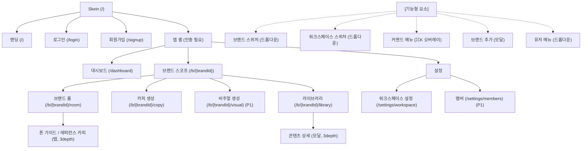
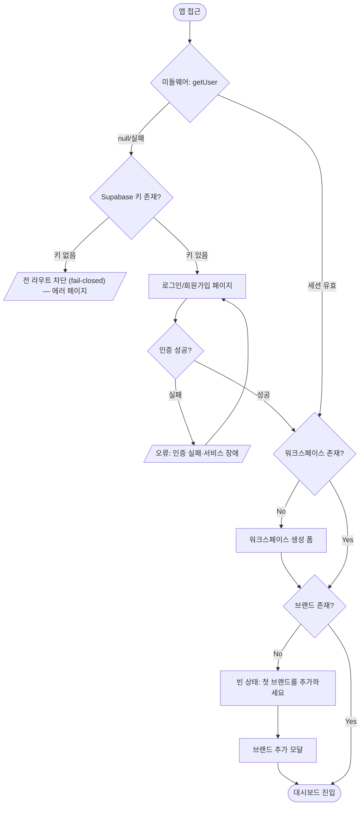
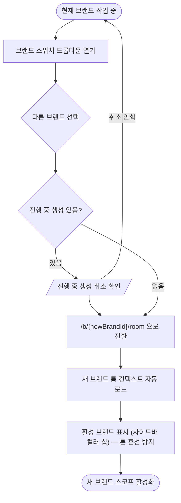

# Skein IA + User Flow
버전: v1.0 | 날짜: 2026.06.10

> 기준: PRD v1.1 (approved). P0 = 인증·워크스페이스·브랜드 룸·AI 카피·라이브러리(+KPI 계측). P1 = AI 비주얼·팀 초대·룸 버전관리·댓글·리포트.
> 라우트는 현 코드(`src/app`)와 일치. P1 화면은 IA에 표기하되 `(P1)` 태그로 구분.

---

## 1. IA

### 1-1. GNB 메뉴 구조 (1depth)

앱은 **글로벌 GNB(상단)가 아니라 좌측 사이드바**가 1차 네비게이션이다(현 `app-sidebar.tsx`). 사이드바는 3블록으로 구성:

| 블록 | 1depth 진입점 | URL | 비고 |
|---|---|---|---|
| 워크스페이스 | 대시보드 | `/dashboard` | 워크스페이스 홈 |
| 브랜드 (활성 브랜드 스코프) | 브랜드 룸 | `/b/{brandId}/room` | 톤 학습 (P0) |
| | 카피 생성 | `/b/{brandId}/copy` | AI 카피 (P0) |
| | 비주얼 생성 `(P1)` | `/b/{brandId}/visual` | AI 비주얼 (P1) |
| | 라이브러리 | `/b/{brandId}/library` | 콘텐츠 + 상태 관리 (P0) |
| 설정 | 워크스페이스 설정 | `/settings/workspace` | 브랜드 CRUD·워크스페이스 |
| | 멤버 `(P1)` | `/settings/members` | 팀 초대·역할 (P1) |

**랜딩/인증 (비로그인 영역, 앱 셸 밖)**

| 페이지 | URL | 비고 |
|---|---|---|
| 랜딩 | `/` | 마케팅 페이지 (구현됨) |
| 로그인 | `/login` | 이메일·구글 (P0) |
| 회원가입 | `/signup` | 베타 데모 신청/가입 (P0) |

### 1-2. 기능형 요소 (1depth 불가 — 오버레이/드롭다운)

| 요소 | 타입 | 트리거 위치 | 비고 |
|---|---|---|---|
| 브랜드 스위처 | 드롭다운 | 사이드바 상단 (`brand-switcher.tsx`) | 활성 브랜드 전환 — 톤 혼선 방지 핵심 |
| 워크스페이스 스위처 | 드롭다운 | 사이드바 상단 (`workspace-switcher.tsx`) | 워크스페이스 전환 |
| 커맨드 메뉴 | 오버레이(⌘K) | 전역 (`command-menu.tsx`) | 빠른 이동·검색 |
| 유저 메뉴 | 드롭다운 | 사이드바 하단 (`nav-user.tsx`) | 로그아웃·계정 |
| 브랜드 추가 | 모달 | 브랜드 스위처/설정 | 브랜드 생성 폼 |
| 콘텐츠 상세 | 모달 | 라이브러리 카드 클릭 | 전체 카피·상태 이력·원본 비교 |
| 삭제 확인 | 다이얼로그 | 브랜드/콘텐츠 삭제 | 파괴적 액션 가드 |
| 토스트 | 오버레이 | 전역 (`sonner`) | 저장 성공·실패 알림 |
| 컨텍스트 부재 경고 | 인라인 배너 | 룸/카피 화면 | 룸 컨텍스트 미설정 시 |

### 1-3. 사이트맵 다이어그램



### 1-4. 범례

- **1depth** — 사이드바 진입점(독립 URL): 대시보드 / 룸 / 카피 / 비주얼(P1) / 라이브러리 / 설정
- **2depth** — 브랜드 스코프 하위(`/b/{brandId}/*`), 설정 하위(`/settings/*`)
- **3depth** — 탭·모달(룸 내부 탭, 콘텐츠 상세 모달) — URL 없거나 쿼리/해시
- **기능형 요소** — 점선 블록. 스위처·커맨드메뉴·모달·토스트. **1depth 불가**
- `(P1)` — 1차 베타(P0) 범위 밖. IA에는 자리만 확보

---

## 2. User Flow

### 2-1. 핵심 플로우 목록 (선정 이유)

| # | 플로우 | 선정 이유 |
|---|---|---|
| F1 | 인증·온보딩 (가입→워크스페이스→첫 브랜드) | 첫 진입 관문. fail-closed 인증·빈 상태 분기 집약 |
| F2 | 브랜드 룸 셋업 (톤 가이드+레퍼런스→컨텍스트 활성화) | 핵심 가정 ③(셋업 30분) 검증 지점. 셋업 시간 계측 시작 |
| F3 | AI 카피 생성 → Draft 저장 | P0 코어. 컨텍스트 자동 주입·부재 경고·AI 에러 집약 |
| F4 | 콘텐츠 승인 루프 (Draft→Review→Approved) | 핵심 가정 ②(통합 워크플로) + KPI 채택률 계측 지점 |
| F5 | 멀티브랜드 전환 | 가정·페인 #4(톤 혼선) 방지. 격리 UX 검증 |

### 2-2. F1 — 인증·온보딩 Flow



- **분기**: 세션 유무 / Supabase 키 유무(fail-closed) / 워크스페이스 유무 / 브랜드 유무
- **에러**: 인증 실패, Auth 서비스 장애(3초 타임아웃), 키 누락 → 전 라우트 차단
- **빈 상태**: 워크스페이스 0개(생성 유도), 브랜드 0개("첫 브랜드를 추가하세요")

### 2-3. F2 — 브랜드 룸 셋업 Flow

```mermaid
flowchart TD
  START([브랜드 룸 진입 /b/{id}/room])
  T0["셋업 타임스탬프 기록 시작 (가정③ 계측)"]
  TAB{탭 선택}
  GUIDE[톤 가이드 입력]
  REF[레퍼런스 카피 추가 + 채널 태그]
  SAVE{저장 성공?}
  ERR_SAVE[/"오류: 저장 실패 — 내용 복사 안내"/]
  CHECK{톤 가이드 + 레퍼런스 충족?}
  BADGE["컨텍스트 활성화 배지 표시"]
  T1["활성화까지 경과 시간 기록"]
  NOTREADY["미충족: 비활성 상태 유지"]

  START --> T0 --> TAB
  TAB -- 톤 가이드 --> GUIDE --> SAVE
  TAB -- 레퍼런스 --> REF --> SAVE
  SAVE -- 실패 --> ERR_SAVE --> TAB
  SAVE -- 성공 --> CHECK
  CHECK -- 충족 --> BADGE --> T1
  CHECK -- 미충족 --> NOTREADY --> TAB
```

- **분기**: 탭(톤 가이드/레퍼런스) / 컨텍스트 충족 여부
- **에러**: 저장 API 실패(입력 유지+복사 안내), 네트워크 단절(저장 버튼 비활성)
- **빈 상태**: 룸 최초 진입 시 가이드·레퍼런스 0건
- **계측**: 셋업 시작~활성화 경과 시간(가정③ 30분 검증)

### 2-4. F3 — AI 카피 생성 Flow (P0 코어)

```mermaid
flowchart TD
  START([카피 생성 진입 /b/{id}/copy])
  CTX{룸 컨텍스트 있음?}
  WARN["경고 배너: 컨텍스트 없음 (계속 진행 가능)"]
  FORM[채널·포맷 선택 + 작업 지시 입력]
  VALID{지시 입력됨?}
  ERR_VALID[/"인라인 오류: 지시 내용을 입력하세요"/]
  GEN["생성: 서버 라우트에서 룸 컨텍스트 주입 + AI 호출"]
  APIOK{AI 응답 성공?}
  ERR_API[/"오류: AI 서비스 장애 / 타임아웃 — 재시도"/]
  EMPTY_RES[/"결과 비어있음 — 다시 시도"/]
  RESULT[결과 표시]
  SAVE{Draft 저장?}
  ERR_DSAVE[/"저장 실패 — 텍스트 복사 안내"/]
  DONE([라이브러리에 Draft 등록 + generated_text 원본 보존])

  START --> CTX
  CTX -- 없음 --> WARN --> FORM
  CTX -- 있음 --> FORM
  FORM --> VALID
  VALID -- 미입력 --> ERR_VALID --> FORM
  VALID -- 입력됨 --> GEN --> APIOK
  APIOK -- 실패 --> ERR_API --> FORM
  APIOK -- 빈결과 --> EMPTY_RES --> FORM
  APIOK -- 성공 --> RESULT --> SAVE
  SAVE -- 실패 --> ERR_DSAVE --> RESULT
  SAVE -- 성공 --> DONE
```

- **분기**: 룸 컨텍스트 유무 / 지시 입력 유효성 / AI 응답 상태
- **에러**: AI API 장애, 타임아웃(제공자 확정 후 기준), 빈 결과, Draft 저장 실패
- **빈 상태**: 컨텍스트 미설정 경고 배너
- **계측**: 저장 시 `generated_text` 원본 보존(KPI 소급 가능성)

### 2-5. F4 — 콘텐츠 승인 루프 Flow (KPI 계측)

```mermaid
flowchart TD
  START([라이브러리 진입 /b/{id}/library])
  HAS{콘텐츠 있음?}
  EMPTY["빈 상태: 아직 생성된 콘텐츠가 없습니다"]
  LIST[브랜드별 콘텐츠 카드 목록]
  CARD[카드 클릭 → 상세 모달]
  STATE{현재 상태}
  REVIEW["리뷰 요청 → Review"]
  APPROVE["승인 → Approved"]
  REWORK["재작업 요청 → Draft (revision_count++)"]
  KPI["승인 시 edited_before_approval 판정 + approved_at 기록"]
  EXPORT[Approved: 텍스트 복사]
  ERR_TRANS[/"상태 전환 실패 — 롤백 + 토스트"/]

  START --> HAS
  HAS -- No --> EMPTY
  HAS -- Yes --> LIST --> CARD --> STATE
  STATE -- Draft --> REVIEW
  STATE -- Review --> APPROVE
  STATE -- Review --> REWORK
  REVIEW --> ERR_TRANS
  APPROVE --> KPI --> EXPORT
  REWORK --> LIST
```

- **분기**: 콘텐츠 유무 / 상태(Draft/Review/Approved) / 승인 vs 재작업
- **에러**: 상태 전환 API 실패(페시미스틱 롤백+토스트), 네트워크 단절(캐시 유지)
- **빈 상태**: 콘텐츠 0개
- **계측(KPI)**: 승인 시 `edited_before_approval`·`revision_count`·`approved_at` → 채택률 산출

### 2-6. F5 — 멀티브랜드 전환 Flow



- **분기**: 진행 중 AI 생성 유무 / 전환 확인
- **에러**: RLS 위반(다른 워크스페이스 브랜드 직접 접근) → 404
- **빈 상태**: 워크스페이스에 브랜드 1개뿐이면 스위처 비활성
- **격리**: 전환 시 활성 브랜드 시각 표시(`brand.color` 칩) — 페인 #4 방지

---

## 3. 주요 화면 와이어프레임 명세 (P0)

### 브랜드 룸 (화면 ID: APP-ROOM)
**목적**: 브랜드 톤을 등록해 AI 카피의 컨텍스트 소스로 활성화.

**레이아웃**: 좌측 사이드바(브랜드 스코프) / 본문 상단 탭(톤 가이드·레퍼런스) / 본문 컨텍스트 활성화 배지.

**구성 요소**
| 요소 | 타입 | 상태 | 액션 |
|---|---|---|---|
| 탭(톤가이드/레퍼런스) | Tabs | 활성 탭 | 전환 |
| 톤 가이드 에디터 | Textarea | 입력/저장중/저장됨 | 저장 |
| 레퍼런스 카피 추가 | Button+Input | — | 추가·채널 태그 |
| 컨텍스트 활성화 배지 | Badge | 활성/비활성 | 상태 표시 |

**빈 상태**: 가이드·레퍼런스 0건 → 입력 유도 / **에러 상태**: 저장 실패 토스트+입력 유지 / **로딩 상태**: 저장 스피너

### AI 카피 생성 (화면 ID: APP-COPY)
**목적**: 룸 컨텍스트 기반 온브랜드 카피 생성 후 Draft 저장.

**구성 요소**
| 요소 | 타입 | 상태 | 액션 |
|---|---|---|---|
| 채널·포맷 선택 | Select | — | 선택 |
| 작업 지시 입력 | Textarea | 활성/오류 | 입력 |
| 생성 버튼 | Button(Primary) | 활성/생성중/비활성 | 생성 |
| 컨텍스트 부재 경고 | Banner | 노출/숨김 | 계속 진행 |
| 결과 카드 | Card | 결과/빈결과 | Draft 저장·재생성·편집 |

**빈 상태**: 컨텍스트 경고 배너 / **에러 상태**: AI 장애·타임아웃 재시도 / **로딩 상태**: 생성 스피너(스트리밍 여부 #10)

### 콘텐츠 라이브러리 (화면 ID: APP-LIB)
**목적**: Draft→Review→Approved 관리 + 채택률 계측.

**구성 요소**
| 요소 | 타입 | 상태 | 액션 |
|---|---|---|---|
| 콘텐츠 카드 | Card | Draft/Review/Approved | 클릭→상세 |
| 상태 배지 | Badge | 3종 | 표시 |
| 상태 전환 버튼 | Button | 활성/처리중 | 리뷰요청·승인·재작업 |
| 상세 모달 | Dialog | — | 원본 vs 현재 비교·이력 |
| 텍스트 복사 | Button | Approved만 | 복사 |

**빈 상태**: "아직 생성된 콘텐츠가 없습니다" / **에러 상태**: 전환 실패 롤백+토스트 / **로딩 상태**: 목록 스켈레톤

---

## Archive (구버전 보존)
*(없음 — v1.0 최초 작성)*
